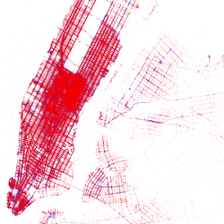

nyc-taxi-tip-predictor &mdash; 
======================

First of all, I must say thank you to [Chris Whong](https://twitter.com/chris_whong) for obtaining the incredible dataset that it's used in this project. [Here](http://chriswhong.com/open-data/foil_nyc_taxi/) is his little odyssey to get the data.

TL;DR
-----

After cleaning and getting a sample from the original dataset, it's possible to predict, with an `accuracy of XX.XX%`, if the tip of a trip in a NYC taxi it's going to be `less thant 20%` or `greater than or equal to 20%` of the charge.

Extended version
----------------

For read an extended version you can read the IPython `notebooks` that describe the complete process. You can find them in this repo, but for a better reading use [this](http://nbviewer.ipython.org/github/josemazo/nyc-taxi-tip-predictor/tree/master/notebooks/) `nbviewer` link.
